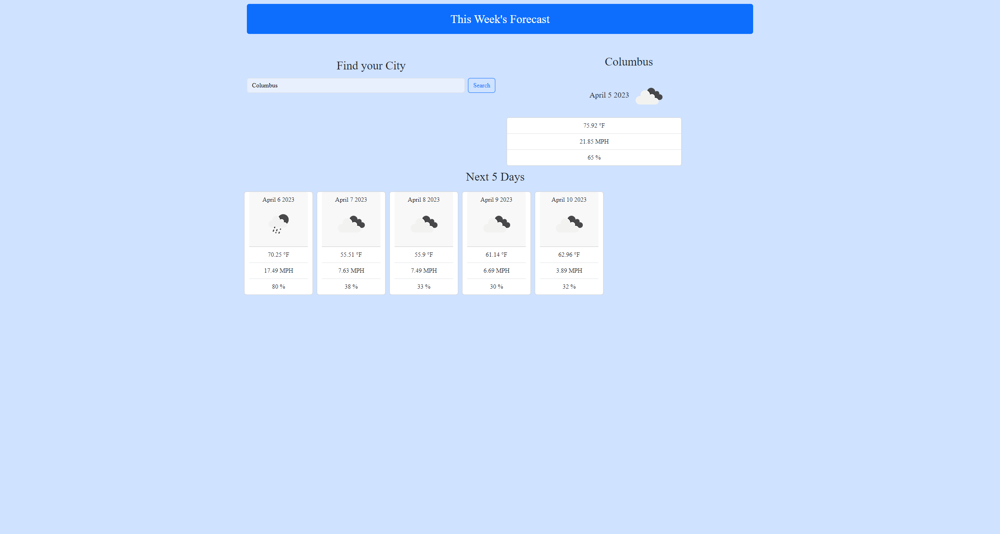

# Weather-App

The purpose of this application is to give the user weather info about any searched city by pulling info from an api

https://m-vanhoose.github.io/Weather-App/

Alan Balcom one of my TAs helped me get the api code started